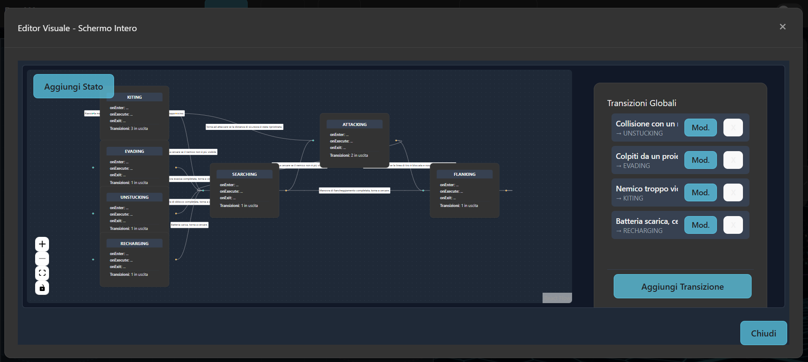
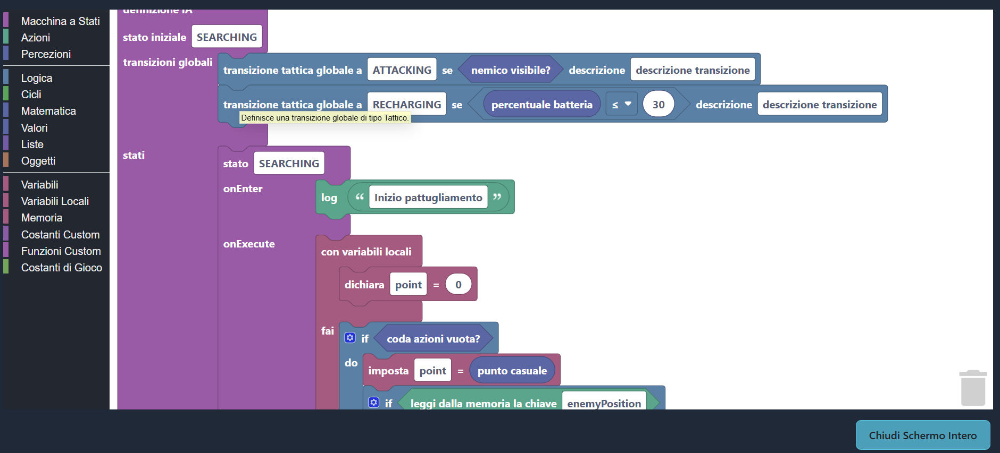
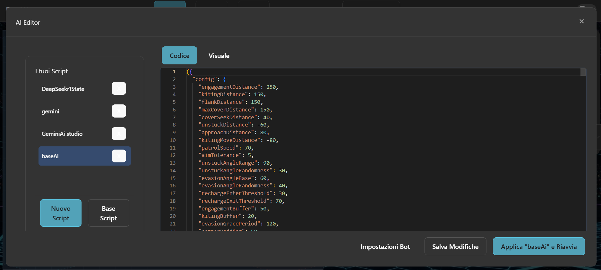

# Bot War: AI Coding Game

[](https://app.netlify.com/sites/ai-botwars/deploys)
[](https://github.com/fra00/bot-war/blob/main/LICENSE)

Un gioco di programmazione che unisce la sfida della codifica con l'emozione della strategia in tempo reale. Hai mai sognato di costruire un robot da combattimento? Qui puoi programmare la sua intelligenza, definire le sue tattiche e poi guardarlo combattere per la supremazia in un'arena virtuale.

<p align="center">
  <a href="https://ai-botwars.netlify.app/" target="_blank"><strong>🚀 Prova la Live Demo 🚀</strong></a>
</p>

<p align="center">
  
</p>

## Cos'è Bot War?

Bot War non è un gioco di riflessi, ma di intelletto. Il tuo compito è **scrivere il cervello del tuo bot**.

Utilizzando JavaScript, scrivi uno script di intelligenza artificiale che detterà ogni mossa, ogni scansione radar e ogni colpo sparato dal tuo bot. Una volta che sei soddisfatto del tuo codice, lo carichi nell'arena e assisti allo scontro. Vincerà la tua logica? O verrai surclassato da una strategia migliore?

Il ciclo di gioco è semplice ma coinvolgente:

1.  **Coda**: Apri l'editor di codice integrato e scrivi o modifica la tua IA.
2.  **Compila**: Con un clic, il tuo script viene "compilato" e caricato nel tuo bot.
3.  **Combatti**: Avvia la simulazione e guarda la tua creazione prendere vita. Analizza le sue decisioni, i suoi punti di forza e le sue debolezze.
4.  **Migliora**: Hai notato un difetto? Il tuo bot è troppo aggressivo o troppo timido? Torna all'editor, affina la tua logica e riprova.

---

## Caratteristiche Principali

Bot War offre un set di strumenti potenti e flessibili per dare vita alle tue creazioni.

### Tre Modalità per Creare la Tua IA

Che tu sia un programmatore esperto o un principiante, abbiamo lo strumento giusto per te.

<p align="center">
  
</p>

- **Editor Visuale a Nodi**: Progetta l'intelligenza del tuo bot in modo intuitivo con il nostro editor visuale. Rappresenta la logica come una **macchina a stati finiti (FSM)**, collegando stati e transizioni. È il modo perfetto per visualizzare il flusso decisionale e iniziare senza scrivere una riga di codice.

<p align="center">
  
</p>

- **Editor a Blocchi (Blockly)**: Costruisci la logica del tuo bot in modo visuale e strutturato usando blocchi che si incastrano tra loro. È un ottimo modo per imparare i concetti di programmazione e creare IA complesse senza preoccuparsi della sintassi.

<p align="center">
  
</p>

- **Editor di Codice Professionale**: Per il massimo controllo, tuffati nel nostro editor basato su **Monaco** (il motore di VS Code). Scrivi JavaScript per definire ogni dettaglio del comportamento del tuo bot, dall'evasione dei proiettili alla gestione dell'energia.

### Multiplayer Online

Pensi che il tuo bot sia il migliore? Mettilo alla prova! Abilita il tuo script per il multiplayer, sfida le creazioni di altri giocatori in partite classificate e scala la classifica globale.

### API Potente e Intuitiva

Il tuo bot ha accesso a una ricca API per interagire con il mondo di gioco: `api.scan()`, `api.fire()`, `api.moveTo(x, y)`, `api.getRandomPoint()`, `api.getMemory()`, `api.getEvents()` e molto altro.

### Parti da una Base Solida

Ogni nuovo giocatore parte con `DefaultAIBase`, un'intelligenza artificiale di base ben commentata e strutturata come una **macchina a stati finiti (FSM)**, un ottimo punto di partenza per le tue personalizzazioni.

### Feedback Istantaneo e Debug

Ogni bot ha una propria console di log. Usa `api.log()` nel tuo codice per tracciare le decisioni del tuo bot in tempo reale e migliorare la tua strategia.

---

## Stack Tecnologico

Bot War è costruito con un moderno stack tecnologico:

- **React** per la creazione di un'interfaccia utente reattiva e componibile.
- **Vite** come build tool per un'esperienza di sviluppo fulminea.
- **TailwindCSS** per uno styling rapido e consistente.
- La logica del gioco è scritta in **JavaScript puro** e disaccoppiata dalla UI, il che la rende robusta e testabile.

## Getting Started (Sviluppo Locale)

Per eseguire il progetto localmente e visualizzare lo showcase dei componenti:

1.  **Clona il repository:**

    ```bash
    git clone https://github.com/fra00/bot-war.git
    cd bot-war
    ```

2.  **Installa le dipendenze:**

    ```bash
    npm install
    ```

3.  **Avvia il server di sviluppo:**
    ```bash
    npm run dev
    ```
    Questo avvierà il server di sviluppo e aprirà l'applicazione nel tuo browser.

---

## Mettiti alla Prova!

Sei pronto a costruire il bot da combattimento definitivo? Che tu voglia creare un aggressore implacabile, un cecchino tattico o un evasore inafferrabile, l'arena ti aspetta. Tuffati nell'editor, dai vita al tuo codice e che il bot migliore vinca!
